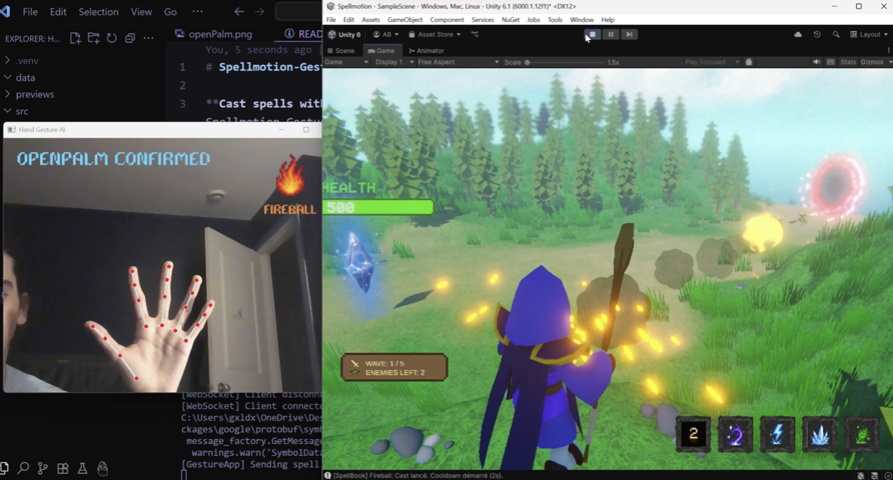
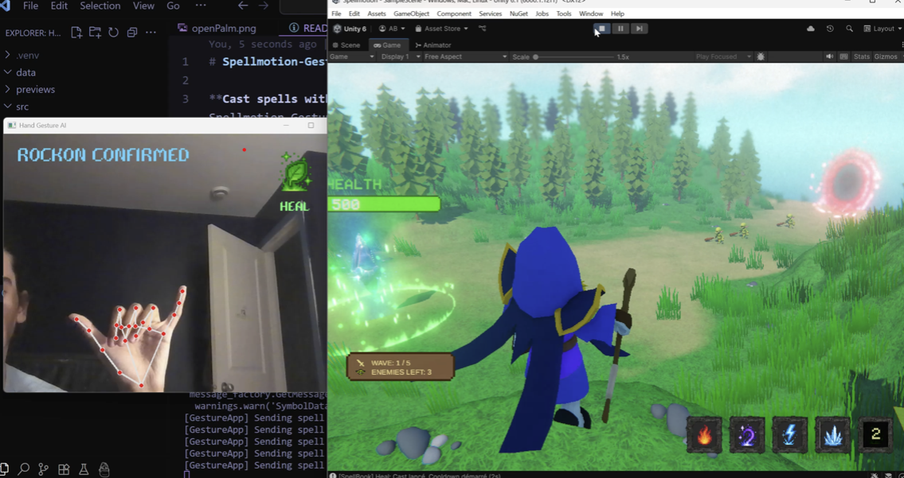
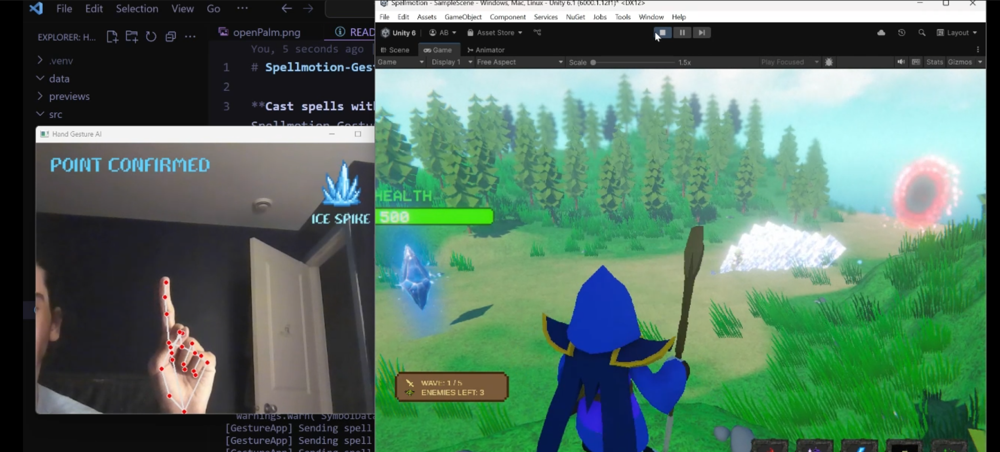

# Spellmotion Unity Game

Welcome to **Spellmotion**, an immersive magic defense game where you become a powerful mage defending the sacred Nexus crystal using only your hand gestures! Through cutting-edge computer vision and AI, your real-world hand movements are transformed into powerful spells to fend off waves of invading goblins.

## Game Overview

As a mage guardian, you must protect the mystical Nexus - a magical crystal that serves as the heart of your realm. Goblins are pouring through a dimensional portal, and only your mastery of gesture-based spellcasting can stop them. Survive 5 increasingly challenging waves using nothing but your hands and the power of magic!

## Spell Arsenal

Master these five powerful spells through intuitive hand gestures:

| Spell | Gesture | Effect |
|-------|---------|--------|
| **Fireball** | Open Palm | Launches a blazing projectile that deals fire damage |
| **Arcane Blast** | Fist | Unleashes a concentrated burst of magical energy |
| **Ice Spikes** | Pointer | Creates sharp ice projectiles that slow enemies |
| **Lightning Bolt** | V-Sign | Strikes with instant electrical damage |
| **Heal** | Rock-On Sign | Restores your health and mana |

## Game Previews

<!-- Add your game screenshots and GIFs here -->

*Live spells in action*

*Fireball*

*Heal the nexus*

*Ice spikes*

## Technologies Used

### Unity Game Enginevisual

- **Unity** - Core game development platform
- **C# Scripting** - Game logic and mechanics

### Networking & Communication

- **WebSocket Protocol** - Real-time communication between gesture recognition app and game
- **JSON Serialization** - Data exchange format for gesture commands

## How It Works

1. **Gesture Recognition**: The companion [Spellmotion Gesture AI app](https://github.com/ben4ali/Spellmotion-Gesture-ai) uses your computer's camera to detect hand gestures in real-time.

2. **Communication**: Recognized gestures are instantly transmitted to the Unity game via WebSocket connection, ensuring minimal latency for responsive gameplay.

3. **Spell Casting**: The Unity game receives gesture data and triggers the corresponding spell effect, complete with visual particles and game mechanics.

## Getting Started

### Prerequisites

- Unity
- The [Spellmotion Gesture AI companion app](https://github.com/ben4ali/Spellmotion-Gesture-ai)
- A computer with a webcam for gesture recognition

### Installation

1. Clone this repository
2. Open the project in Unity
3. Set up and run the [Spellmotion Gesture AI app](https://github.com/ben4ali/Spellmotion-Gesture-ai)
4. Launch the Unity game and start defending the Nexus!

## Game Features

- **Intuitive Gesture Controls**: No controllers needed, just use your hands
- **Progressive Difficulty**: 5 waves of increasing challenge
- **Magical Visual Effects**: Stunning particle systems and spell animations
- **Real-time Feedback**: Instant response to gesture inputs
- **Strategic Gameplay**: Different spells for different tactical situations
